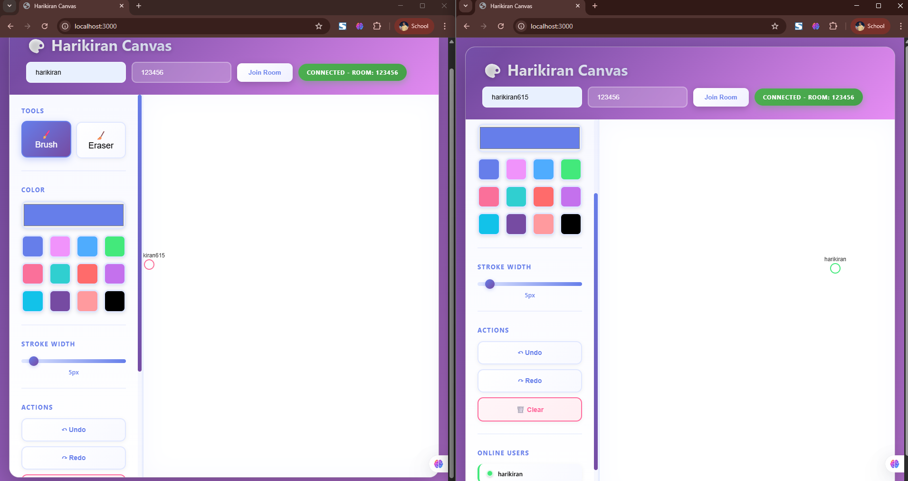
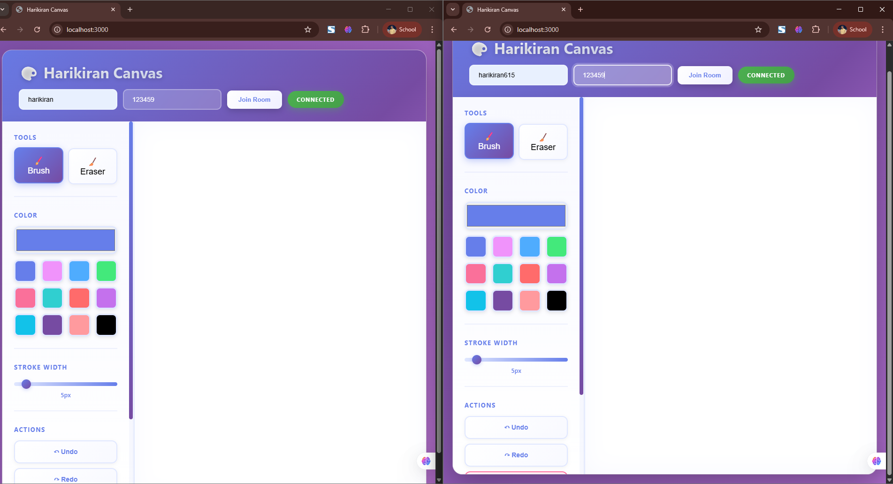
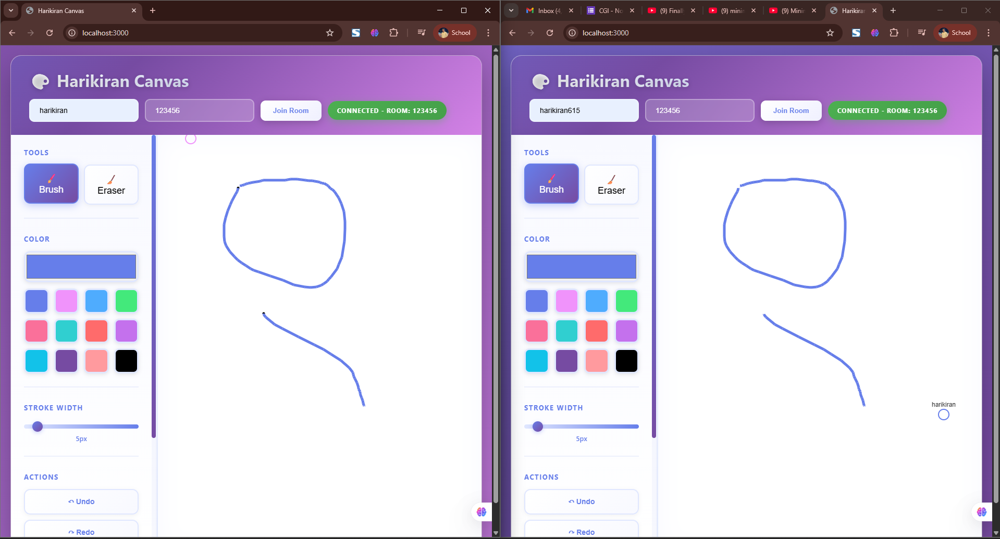
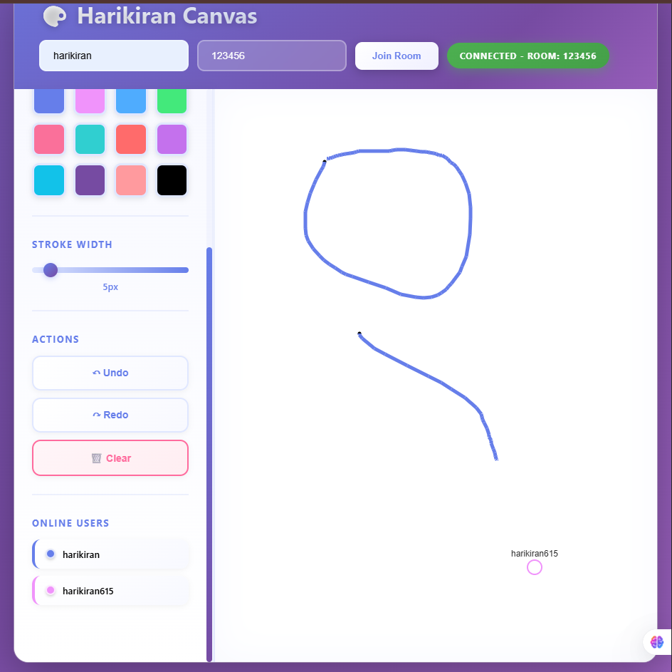
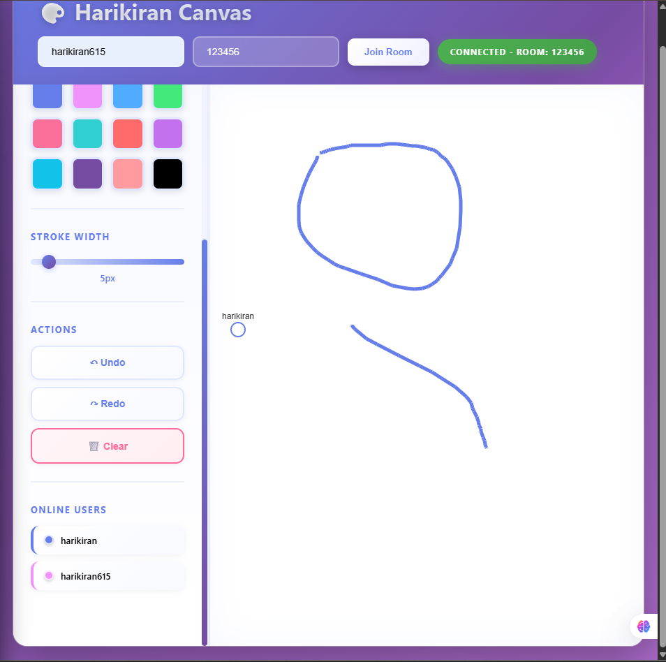

# Harikiran Canvas - Real-Time Collaborative Drawing

A multi-user drawing application where multiple people can draw simultaneously on the same canvas with real-time synchronization.

## 📸 Demo & Screenshots

### Screenshots Gallery

Here are the demo screenshots showcasing the application:

#### 1. Main Application Interface

*Beautiful gradient design with modern UI*

#### 2. Real-Time Collaboration

*Multiple users drawing simultaneously*

#### 3. Multiple Users Drawing

*Shared canvas with real-time synchronization*

#### 4. User Interface & Toolbar

*Complete toolbar with all drawing tools*

#### 5. Collaborative Session

*Active collaboration with user cursors visible*

### Demo Video

Watch the complete walkthrough and demonstration:

**📹 [Watch Demo Video](video/1.mp4)**

The demo video includes:
- ✅ Setting up and joining rooms
- ✅ Real-time collaborative drawing
- ✅ Multiple users interacting simultaneously
- ✅ All features in action
- ✅ User interface walkthrough
- ✅ Real-time synchronization demonstration

> **Note**: Click the link above or navigate to `video/1.mp4` to watch the full demonstration

> 💡 **Tip**: The screenshots and video above show the application's capabilities. Try it yourself by following the Quick Start guide below!

## 🚀 Quick Start

### Prerequisites

- Node.js (v16 or higher)
- npm or yarn

### Installation & Running

1. **Install dependencies:**
   ```bash
   npm install
   ```

2. **Start the server:**
   ```bash
   npm start
   ```
   
   Or for development with auto-restart:
   ```bash
   npm run dev
   ```

3. **Open your browser and navigate to:**
   ```
   http://localhost:3000
   ```

The server will start on port 3000 by default. You can change this by setting the `PORT` environment variable:
```bash
PORT=3001 npm start
```

## 🧪 Testing with Multiple Users

### Method 1: Multiple Browser Windows/Tabs

1. Open `http://localhost:3000` in your browser
2. Enter a name (e.g., "Alice") and optionally a room ID
3. Click "Join Room"
4. Open another browser window/tab to `http://localhost:3000`
5. Enter a different name (e.g., "Bob") and the **same room ID** (or leave empty for a new room)
6. Click "Join Room"
7. Start drawing in both windows - you should see real-time synchronization!

### Method 2: Multiple Devices

1. Find your local IP address:
   - Windows: `ipconfig` (look for IPv4 Address)
   - Mac/Linux: `ifconfig` or `ip addr`
2. On your server machine, start the server
3. On other devices on the same network, navigate to `http://YOUR_IP:3000`
4. Join the same room ID to collaborate

### Method 3: Browser DevTools

1. Open the application in Chrome/Edge
2. Open DevTools (F12)
3. Click the three-dots menu → "More tools" → "Network conditions"
4. Enable "Disable cache"
5. Open a new incognito/private window for a second user

## 🎨 Features

### Drawing Tools
- **Brush**: Draw with customizable colors and stroke widths
- **Eraser**: Remove parts of the drawing
- **Color Picker**: Choose from preset colors or use the color picker
- **Stroke Width**: Adjust from 1px to 50px

### Real-Time Collaboration
- **Live Drawing**: See other users' drawings as they draw (not after they finish)
- **User Cursors**: Visual indicators showing where other users are currently positioned
- **User List**: See who's online in the current room
- **Color-Coded Users**: Each user gets a unique color for easy identification

### Advanced Features
- **Global Undo/Redo**: Undo and redo operations work across all users
- **Conflict Resolution**: Handles simultaneous drawing in overlapping areas
- **Room System**: Join specific rooms or create new ones
- **Canvas State Sync**: New users receive the current canvas state when joining

## 🔄 Data Flow

### Drawing Event Flow

When a user draws, here's what happens:

1. **User Action**: User clicks and drags on canvas (mouse/touch event)
2. **Local Rendering**: Canvas immediately renders the stroke locally for instant feedback (optimistic rendering)
3. **Event Serialization**: Drawing data (coordinates, color, tool) is serialized into WebSocket messages
4. **Server Processing**: Server receives event, validates it, and stores in Drawing State Manager
5. **Server Broadcast**: Server broadcasts the event to all other users in the same room
6. **Remote Rendering**: Other clients receive the event and render it on their canvas
7. **State Update**: Server updates the global canvas state for new users joining later

### State Synchronization

- **Server as Source of Truth**: The server maintains the canonical canvas state
- **Client Replication**: Each client maintains a local copy for fast rendering
- **On Join**: New users receive the complete canvas state when joining a room
- **On Reconnect**: Disconnected users receive full state when reconnecting
- **Consistency**: All clients sync to the same state through server broadcasts

## 🏗️ System Architecture

### High-Level Architecture Diagram

```
┌─────────────┐         ┌─────────────┐         ┌─────────────┐
│   Client A  │         │   Client B  │         │   Client C  │
│  (Browser)  │         │  (Browser)  │         │  (Browser)  │
└──────┬──────┘         └──────┬──────┘         └──────┬──────┘
       │                        │                        │
       │  WebSocket             │  WebSocket             │  WebSocket
       │  (Socket.IO)           │  (Socket.IO)           │  (Socket.IO)
       │                        │                        │
       └────────────────────────┼────────────────────────┘
                                │
                    ┌───────────▼───────────┐
                    │   Node.js Server      │
                    │  (Express + Socket.IO)│
                    └───────────┬───────────┘
                                │
                ┌───────────────┼───────────────┐
                │               │               │
        ┌───────▼──────┐ ┌─────▼──────┐ ┌─────▼──────┐
        │ Room Manager │ │ Drawing    │ │  Socket    │
        │              │ │ State      │ │  Events    │
        │ - Users      │ │ Manager    │ │  Handler   │
        │ - Colors     │ │ - Ops      │ │            │
        │ - Rooms      │ │ - Undo/Redo│ │            │
        └──────────────┘ └────────────┘ └────────────┘
```

### Architecture Explanation

#### **Client Layer (Browser)**
- **Multiple Clients**: Each browser instance (Client A, B, C) runs the frontend application
- **WebSocket Connection**: Each client establishes a persistent WebSocket connection using Socket.IO
- **Real-Time Communication**: Bidirectional communication allows clients to send drawing events and receive updates from other users

#### **Server Layer (Node.js)**
- **Central Server**: Single Node.js server running Express.js for HTTP and Socket.IO for WebSocket connections
- **Event-Driven Architecture**: Server processes events asynchronously, handling multiple clients simultaneously
- **Connection Management**: Manages all WebSocket connections and routes events appropriately

#### **Server Modules**

1. **Room Manager**
   - **Users**: Tracks all connected users, assigns unique IDs and colors
   - **Colors**: Manages color assignment for user identification
   - **Rooms**: Handles room creation, joining, and user-room associations
   - **Purpose**: Organizes users into collaborative spaces (rooms)

2. **Drawing State Manager**
   - **Operations (Ops)**: Stores all drawing operations (brush strokes, eraser actions) with their properties
   - **Undo/Redo**: Maintains operation history stacks for global undo/redo functionality
   - **State Persistence**: Keeps track of canvas state per room
   - **Purpose**: Manages the actual drawing data and operation history

3. **Socket Events Handler**
   - **Event Processing**: Handles incoming WebSocket events from clients
   - **Event Broadcasting**: Distributes events to appropriate clients in the room
   - **Event Validation**: Validates and processes drawing events before broadcasting
   - **Purpose**: Orchestrates real-time communication between clients

### How It Works Together

1. **User Joins**: Client connects via WebSocket → Server registers user in Room Manager → User assigned to room
2. **User Draws**: Client sends drawing event → Socket Events Handler processes → Drawing State Manager stores operation → Event broadcasted to other clients in room
3. **Real-Time Sync**: All clients in same room receive events → Each client renders on their canvas → State stays synchronized
4. **State Management**: Drawing State Manager maintains canonical state → New users receive full state on join → Undo/redo operations sync across all clients

### Key Design Decisions

- **Centralized Server**: Single source of truth for canvas state ensures consistency
- **Room-Based Architecture**: Allows multiple independent collaborative sessions
- **Modular Design**: Separation of concerns (rooms, state, events) improves maintainability
- **Event-Driven**: Asynchronous event handling supports high concurrency
- **WebSocket Protocol**: Low-latency bidirectional communication for real-time updates

## 📁 Project Structure

```
harikiran-canvas/
├── client/
│   ├── index.html          # Main HTML file
│   ├── style.css           # Styling
│   ├── canvas.js           # Canvas drawing logic
│   ├── websocket.js        # WebSocket client
│   └── main.js             # App initialization
├── server/
│   ├── server.js           # Express + Socket.IO server
│   ├── rooms.js            # Room management
│   └── drawing-state.js    # Canvas state management
├── photos/                 # Demo screenshots
│   ├── 1.png
│   ├── 2.png
│   ├── 3.png
│   ├── 4.png
│   └── 5.png
├── video/                  # Demo videos
│   └── 1.mp4
├── package.json
├── README.md
└── ARCHITECTURE.md
```

## 🛠️ Technologies Used

### Frontend
- **HTML5 Canvas API**: For drawing operations and rendering
- **Vanilla JavaScript (ES6+)**: No frameworks - pure JavaScript
- **CSS3**: Modern styling with gradients, animations, and responsive design
- **Socket.IO Client**: Real-time WebSocket communication

### Backend
- **Node.js**: JavaScript runtime environment
- **Express.js**: HTTP server and static file serving
- **Socket.IO**: WebSocket server for real-time bidirectional communication
- **UUID**: Unique identifier generation for users and operations

### Key Concepts
- **WebSocket Protocol**: Persistent, low-latency bidirectional communication
- **Event-Driven Architecture**: Asynchronous event handling
- **Operation-Based State**: Efficient state management using operations instead of images
- **Optimistic Rendering**: Instant local feedback before server confirmation
- **Event Throttling**: Performance optimization by limiting event frequency

## 🔧 Development

### Development Mode

For development with auto-restart:

```bash
npm run dev
```

This will automatically restart the server when you make changes to the code.

## ⚠️ Known Limitations

1. **Clear Function**: The clear function is currently local-only and doesn't sync across users. This is intentional to prevent accidental canvas clearing.

2. **Mobile Support**: Touch events are supported, but the UI is optimized for desktop. Mobile experience may vary.

3. **Network Latency**: On high-latency connections, there may be slight delays in real-time synchronization. The system uses throttling to optimize performance.

4. **Canvas Size**: The canvas automatically resizes to fit the container, but very large canvases may impact performance.

5. **Browser Compatibility**: Requires modern browsers with WebSocket and Canvas API support (Chrome, Firefox, Edge, Safari).

6. **No Persistence**: Canvas state is not persisted to a database. When all users leave a room, the canvas state is lost.

## 🐛 Troubleshooting

### Server won't start
- Check if port 3000 is already in use
- Try changing the PORT environment variable: `PORT=3001 npm start`
- Ensure all dependencies are installed: `npm install`

### Can't see other users' drawings
- Check browser console for errors
- Verify both users are in the same room (same room ID)
- Check network connection
- Ensure WebSocket connections are not blocked by firewall

### Drawing is laggy
- Check network latency
- Reduce stroke width or drawing speed
- Close other browser tabs/applications
- Check server CPU/memory usage

### JavaScript errors
- Run `npm install` to ensure all dependencies are installed
- Check Node.js version (should be v16+)
- Delete `node_modules` folder and reinstall: `rm -rf node_modules && npm install` (Windows: `rmdir /s node_modules && npm install`)

## 📝 Time Spent

This project was developed as a comprehensive assignment demonstrating:
- Canvas API mastery
- Real-time WebSocket communication
- State synchronization
- Conflict resolution strategies
- TypeScript implementation

Estimated development time: 15-20 hours

## 📄 License

MIT License - feel free to use this project for learning and development.

## 🤝 Contributing

This is an assignment project, but suggestions and improvements are welcome!

